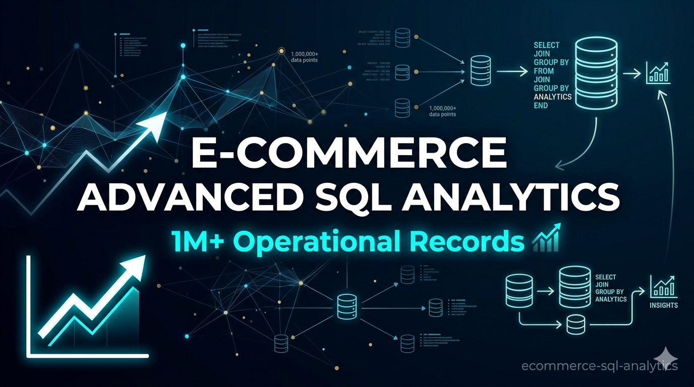

# 📈 E-Commerce Advanced SQL Analytics: 1M+ Operational Records

<!-- PROJECT BANNER PLACEHOLDER -->

## 🎯 Executive Summary
In the modern retail ecosystem, data redundancy and unoptimized data streams can drain company resources and mask critical financial leakage. This project showcases the end-to-end data engineering and business intelligence workflow of a **Data Analyst** acting across **Financial Control, Operations, and Growth Marketing**.

Operating on a high-volume Amazon retail dataset containing **over 1,000,000 raw transactional records**, I designed, implemented, and populated a highly optimized relational **Star Schema** data warehouse in PostgreSQL. Beyond database normalization and maintaining strict data quality constraints, this repository leverages high-performance window functions and advanced aggregations to deliver actionable, data-driven answers to complex corporate bottlenecks.

---

## 🚀 Key Business Problems Solved
This analytical suite directly targets three critical corporate challenges:
1. **User Retention & Omnichannel Loyalty:** Identifying exactly how many days a customer takes to make a repeat purchase across different platforms.
2. **Revenue Leakage Control:** Highlighting specific supplier-category combinations responsible for catastrophic item return rates.
3. **Cumulative Growth Velocity:** Providing corporate leadership with real-time running totals of revenue generation across major product segments to measure progress against annual benchmarks.

---
