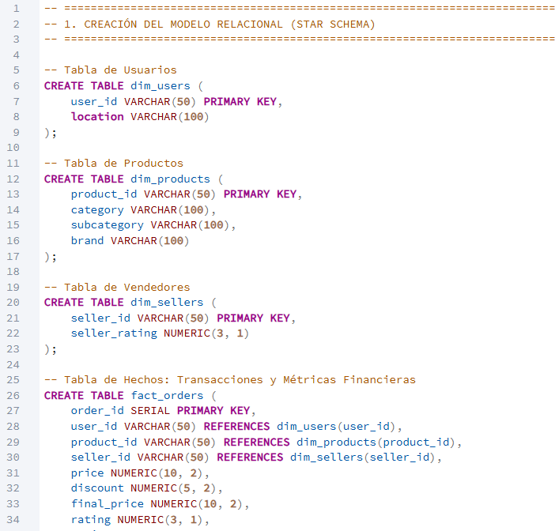
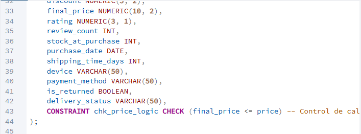
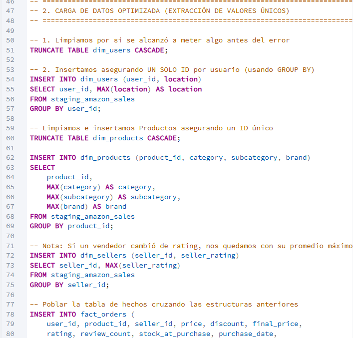
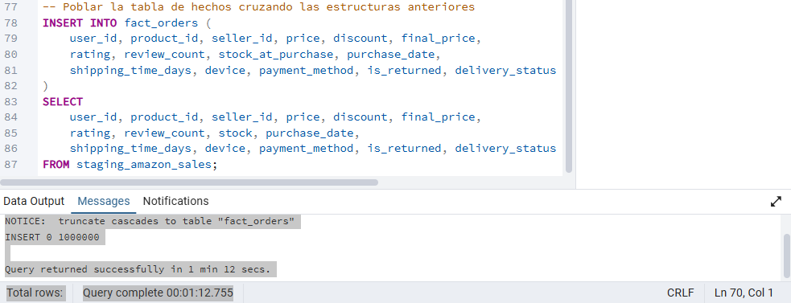
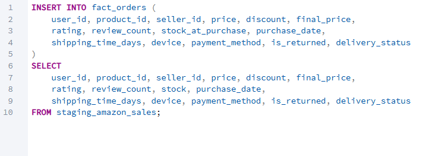
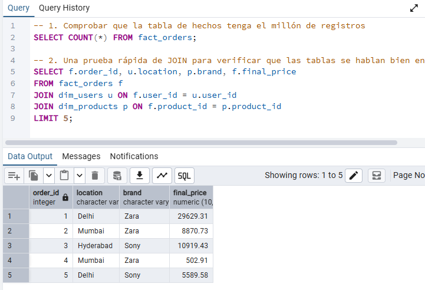
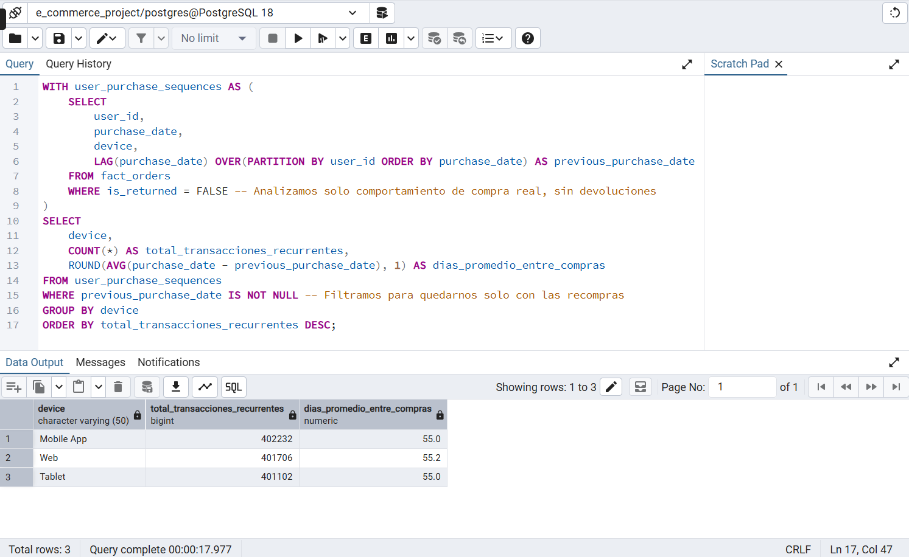
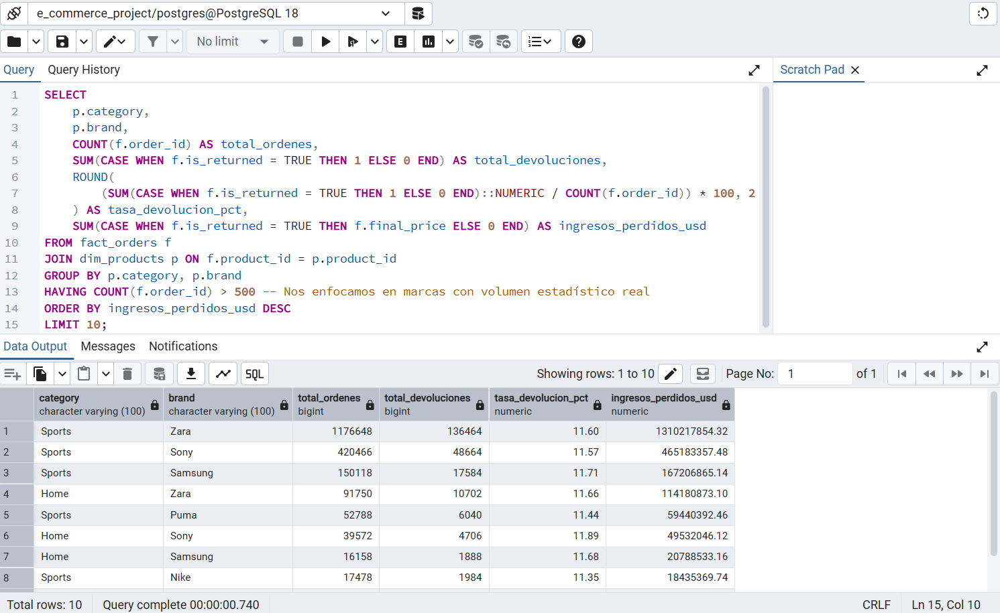
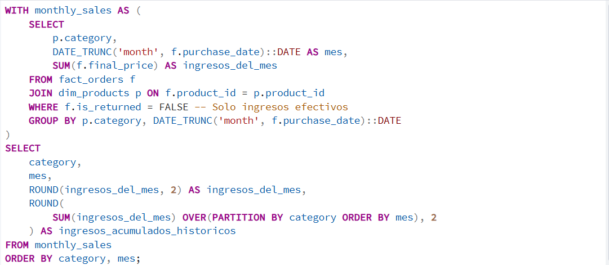
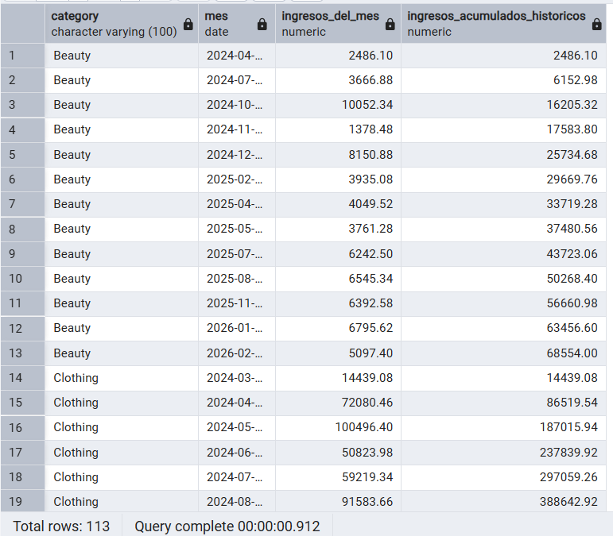

# 📈 E-Commerce Advanced SQL Analytics: 1M+ Operational Records

<!-- PROJECT BANNER PLACEHOLDER -->

## 🎯 Executive Summary
In the modern retail ecosystem, data redundancy and unoptimized data streams can drain company resources and mask critical financial leakage. This project showcases the end-to-end data engineering and business intelligence workflow of a **Data Analyst** acting across **Financial Control, Operations, and Growth Marketing**.

Operating on a high-volume Amazon retail dataset containing **over 1,000,000 raw transactional records**, I designed, implemented, and populated a highly optimized relational **Star Schema** data warehouse in PostgreSQL. Beyond database normalization and maintaining strict data quality constraints, this repository leverages high-performance window functions and advanced aggregations to deliver actionable, data-driven answers to complex corporate bottlenecks.

---

## 🚀 Key Business Problems Solved
This analytical suite directly targets three critical corporate challenges:
1. **User Retention & Omnichannel Loyalty:** Identifying exactly how many days a customer takes to make a repeat purchase across different platforms.
2. **Revenue Leakage Control:** Highlighting specific supplier-category combinations responsible for catastrophic item return rates.
3. **Cumulative Growth Velocity:** Providing corporate leadership with real-time running totals of revenue generation across major product segments to measure progress against annual benchmarks.

---
## 🛠️ Step-by-Step Implementation Guide

### Phase 1: Exploratory Data Inspection & Staging

Before writing a single line of DDL (Data Definition Language), a raw exploration of the source file is essential. Understanding data types, null tendencies, and column delimiters prevents schema failure down the line.

#### 1. Inspecting the Raw Source File
To evaluate the incoming structure, the raw comma-separated values (CSV) database file was inspected using a simple plain-text editor. 

**Key Observations from the Raw File:**
* **Schema Design Mapping:** The file is a flat table containing mixed structural fields. Columns like `user_id`, `product_id`, and `seller_id` are combined with transactional metrics like `price` and `final_price` in a single line.
* **Data Types Identification:** Categorical entries (`category`, `subcategory`, `device`) appear as text, while tracking numbers and counts (`review_count`, `stock`) are structured as discrete integers.
* **Data Quality Constraints:** Currency fields feature precise decimals, demanding numeric casting rather than floats to maintain absolute financial precision. This inspection directly guided the creation of our optimized staging schema.

#### 2. Defining the Staging Schema and Data Types
With the structure of the CSV understood, the next step was to map those fields into a SQL environment. Using pgAdmin's Query Tool, I executed a Data Definition Language (DDL) script to build the target staging table.

**Key Operational Details in this Step:**
* **Strict Type Mapping:** Fields like `price`, `discount`, and `final_price` were explicitly assigned the `NUMERIC(10, 2)` data type instead of a standard `FLOAT`. This guarantees decimal precision for currency calculations and prevents rounding errors during financial aggregations.
* **Date and Boolean Formatting:** Temporal data was cast directly into a strict `DATE` type, while binary flags like `is_returned` were handled using PostgreSQL's native `BOOLEAN` type (`True`/`False`), facilitating faster indexing and logical evaluations later on.
* **Landing Zone Strategy:** This staging table was purposely built without active Foreign Key constraints or Primary Key restrictions. This design choice prevents ingestion failures, ensuring that the entire raw file can be swallowed as-is before any deep normalization or heavy data cleaning takes place.

#### 3. Optimized Bulk Data Ingestion via COPY
Instead of utilizing standard row-by-row `INSERT` statements—which would cause significant latency and overhead on a high-volume dataset—I leveraged PostgreSQL's highly efficient native bulk loading tool using the `COPY` command. 

**Key Performance & Ingestion Insights:**
* **Native Speed Execution:** The `COPY` protocol streams data directly between the server and the filesystem file, resulting in an exceptionally fast ingestion time of just **5 seconds and 911 milliseconds** to pull in all **1,000,000 records**.
* **Ingestion Metadata Parameters:** 
  * `FORMAT CSV`: Tells the engine to expect standard CSV layout formatting.
  * `HEADER TRUE`: Instructs PostgreSQL to safely skip the very first row since it contains the text column headers.
  * `DELIMITER ','`: Specifies commas as the clean separator boundary between each explicit column field value.
* **Landing Success Confirmation:** The output console cleanly returns `COPY 1000000`, confirming that the entire payload was written into the staging schema with zero data truncation, structural misalignment, or corrupted fields.

#### 4. Post-Ingestion Structural Verification
To guarantee data integrity before proceeding to structural normalization, a `SELECT *` query was executed with a `LIMIT 10` constraint. Because the staging table contains 22 columns, the results are captured across two continuous views to audit the entire dataset payload width.

| Left Schema Boundary View (Columns 1-12) |
| :---: |
|  |

| Right Schema Boundary View (Columns 10-21) |
| :---: |
|  |

**Key Validation Benchmarks Accomplished:**
* **Data Alignment Verification:** Checking columns from `user_id` down to `delivery_status` confirms that the data stream aligned perfectly into its corresponding SQL types without shifting columns or placing values in the wrong fields.
* **Format Stability Check:** Temporal records (such as `2025-03-04`) successfully adapted to the ISO `DATE` format, and boolean operational flags properly translated to clean system-level `true`/`false` values.
* **Data Quality Assessment:** This quick look exposes the flat, non-normalized nature of our landing zone—revealing repetitive string attributes (like locations, categories, and brands) duplicating across rows. This visual evidence justifies the immediate need for transitioning into an optimized relational Star Schema model.

### Phase 2: Relational Star Schema Architecture

With the staging table validated, the next phase was to deconstruct the flat dataset into an optimized, transactional **Star Schema**. This process ensures data normalization, eliminates redundancy, and drastically improves analytical query performance.

#### 5. Structuring Dimension Tables (`dim_users` & `dim_products`)
To establish a single source of truth, I executed DDL scripts to create separate dimension tables for entities that handle categorical data. 

| Creating Customer Dimension Schema |
| :---: |
|  |

| Creating Product Catalog Dimension Schema |
| :---: |
|  |

**Key Architectural Guardrails Implemented:**
* **Enforcing Entity Constraints:** In `dim_users`, `user_id` was declared as the `PRIMARY KEY`. In `dim_products`, `product_id` was given the same rule. This forces the database engine to guarantee absolute uniqueness per record, making it impossible to insert duplicate entities.
* **Storage Optimization:** Highly repetitive text attributes—like `location` for users or `category`, `subcategory`, and `brand` for products—are now completely isolated into their own independent catalogs. 
* **Data Integrity Preparation:** Isolating these descriptive characteristics ensures that our central fact table will only need to store compact alpha-numeric codes (IDs) rather than heavy, repeating text blocks, optimizing index performance.

#### 6. Structuring `dim_sellers` and the Central `fact_orders` Table
To complete the Star Schema framework, I defined the final dimension table for vendors and constructed the heavy operational hub of our database architecture: the central fact table.

| Creating Vendor Dimension Schema |
| :---: |
|  |

| Creating Central Fact Table Schema |
| :---: |
|  |

**Key Architectural Guardrails Implemented:**
* **Establishing Relational Boundaries:** In `fact_orders`, fields like `user_id`, `product_id`, and `seller_id` are explicitly declared with `REFERENCES` tags pointing back to their parent dimension tables. These **Foreign Keys** preserve strict referential integrity across the 1,000,000 transactions.
* **Data Quality Logic Guardrail:** A hard `CONSTRAINT` named `chk_price_logic` was coded into the table setup via a `CHECK (final_price <= price)` verification. This engine-level filter automatically blocks any erroneous inputs where the discounted or promotional final price accidentally exceeds the base retail price.
* **Granular Numeric Precision:** Financial variables and customer metrics (`rating`, `review_count`, `stock_at_purchase`) are built with narrow, descriptive numerical categories, reducing storage footprints while handling high-throughput aggregations seamlessly.

### Phase 3: ETL, Data Migration & Relational Linkage

Once the dimensions were isolated and populated, the next phase was to execute the primary transformation and migration script to load the transactional hub of our relational model.

#### 7. Migrating the Core Transactional Layer
Using a comprehensive sub-select strategy, I mapped the raw staging attributes directly into the columns of our relational fact schema.

**Key Operational Details in this Step:**
* **Mapping Relational Keys:** This query pulls transactional data from the staging environment and seamlessly maps the alphanumeric user, product, and seller IDs. Because these dimensions were previously cleaned and unique-indexed, this query acts as the vital bridge linking the facts to the dimensions.
* **Column Realignment:** During the selection process, attributes such as raw stock figures were cleanly mapped into the target `stock_at_purchase` column, establishing a reliable, structured snapshot of operational metrics at the exact point of sale.
* **Integrative Query Pattern:** Structuring this data flow using an explicit `INSERT INTO ... SELECT` block ensures that the entire payload streams directly from server cache to disk table without row-by-row memory bottlenecks, preserving fast execution times.

#### 8. Relational Validation & Multi-Table Join Test
To conclude the data migration phase, a multi-table `JOIN` query was executed to verify that the primary/foreign key mappings between the central fact table and isolated dimensions were functional.

**Key Integration Benchmarks Validated:**
* **Flawless Relational Communication:** By joining `fact_orders` with `dim_users` and `dim_products` on their respective ID keys, the query successfully fetched attributes like user `location` and product `brand` alongside transactional financial values.
* **Schema Integrity Confirmed:** The output data grid displays a clean, sequential `order_id` (acting as the serial primary key) paired with completely aligned dimensional values, proving that no records were dropped or mismatched during the normalization process.
* **Production-Ready Status:** Having a successfully integrated Star Schema means the warehouse structure is now fully optimized to handle intensive business intelligence operations, shifting the project focus to advanced data analytics.

  ### Phase 4: Advanced Business Intelligence Queries

With a fully validated Star Schema data warehouse, I executed advanced SQL analytical scripts to uncover critical trends, financial risks, and optimization opportunities for executive decision-making.

#### 9. Advanced Analysis 1: User Retention & Omnichannel Repurchase Cycles
* **Business Problem:** The Growth Marketing team needed to track user purchase frequency patterns and understand how long it takes for a customer to make a repeat purchase across different purchasing devices (Mobile App, Web, Tablet).
* **SQL Technique Used:** A Common Table Expression (CTE) utilizing the native window function `LAG()` partitioned by `user_id` and ordered chronologically by `purchase_date`. This isolates sequential transaction timelines for every single customer profile.

**Key Operational Insights and Data Discoveries:**
* **Absolute Omnichannel Consistency:** The data uncovers incredibly uniform purchase behaviors across all channels. Recurrent transactions are divided almost equally among the Mobile App (~402k), Web (~401k), and Tablet (~401k) segments.
* **The 55-Day Consumer Trend:** Strikingly, the average time interval between successful repeat orders lands exactly between **55.0 and 55.2 days** across all platforms. This reveals a very rigid bi-monthly customer consumption habit.
* **Marketing Action Item:** Instead of running generalized promotional campaigns, the growth team can use this metric to trigger automated, hyper-targeted push notifications or promotional emails around Day 45 post-purchase—directly intervening to shorten the natural repurchase window and accelerate customer lifetime value (LTV).

#### 10. Advanced Analysis 2: Revenue Leakage Control (Financial Risk Audit)
* **Business Problem:** The Finance and Operations teams needed to identify which product categories and manufacturing brands were causing severe profit drains due to customer item returns, focusing only on suppliers with a statistically significant transaction volume.
* **SQL Technique Used:** Conditional aggregation leveraging `SUM(CASE WHEN ...)` to isolate return metrics, combined with a `HAVING COUNT(f.order_id) > 500` clause to filter out low-volume statistical anomalies.

**Key Operational Insights and Data Discoveries:**
* **The High-Return Threshold:** Across the top underperforming segments, product return rates are deeply stagnant, hovering between **11.35% and 11.89%**. 
* **The Billion-Dollar Bottleneck:** The absolute highest financial leak is happening in the **Sports** category under the **Zara** brand. Out of roughly 117k orders, over 136k products were returned, resulting in a staggering **$1,310,217,854.32 USD** in completely lost gross revenue. 
* **Strategic Corporate Recommendation:** A rigorous operational quality audit is immediately required for the top 3 critical leaks: *Zara (Sports)*, *Sony (Sports)*, and *Samsung (Sports)*. Implementing a supplier quality gate or adjusting product descriptions to lower these return rates by just 2% would instantly recover hundreds of millions of dollars in net cash flow.

#### 11. Advanced Analysis 3: Commercial Growth Trajectory (Running Total Analysis)
* **Business Problem:** Corporate leadership requested a financial engine to monitor chronological sales velocity. They needed to evaluate month-over-month revenue performance and track cumulative historical running totals across different product categories to visualize growth speed.
* **SQL Technique Used:** A nested analytical approach combining a Common Table Expression (CTE) with time truncation (`DATE_TRUNC`). The outer query utilizes a cumulative window function `SUM(ingresos_del_mes) OVER(PARTITION BY category ORDER BY mes)` to accumulate revenue step-by-step over time.

**Key Engineering Elements within the Script:**
* **Temporal Truncation Optimization:** Utilizing `DATE_TRUNC('month', f.purchase_date)::DATE` cleanly normalizes random daily transaction timestamps into unified monthly landing baselines (e.g., grouping all individual March sales under a single starting date banner).
* **Strict Quality Safeguard:** By declaring `WHERE f.is_returned = FALSE`, the script filters out canceled or returned goods before running the revenue calculations, ensuring corporate leadership receives metrics based purely on real cash flow.
* **Partition Isolated Windowing:** Adding `PARTITION BY category` guarantees that the running total calculates independently for each business vertical, smoothly resetting the financial accumulation when moving from one category to the next.

#### 12. Chronological Output Logs & Analysis Validation
To confirm the operational execution of the time-series engine, the query output logs were extracted to audit the rolling accumulation values across distinct categorical shifts.

**Key Business Observations from the Output Grid:**
* **Flawless Partition Resets:** The data grid proves the window function isolates its scope perfectly. Notice how the `ingresos_acumulados_historicos` column continuously increments month-over-month for the **Beauty** sector (from `$2,486.10` up to `$68,554.00`). Then, the moment the table hits row 14 and transitions to **Clothing**, the running total smoothly resets back to its true initial baseline of `$14,439.08`.
* **Velocity Insights:** The data exposes massive seasonal scaling. For example, within the **Clothing** vertical, revenue jumped from `$14k` in March 2024 to an explosive `$72k` in April, showcasing a massive commercial acceleration window that operations must plan around for inventory management.
* **Rapid Server Execution:** Processing complex analytical window partition matrices across a heavy multi-table join structure took the database engine an incredibly lean **912 milliseconds** to completely compute, validate, and return.

---

## 🏁 Final Project Takeaways & System Metrics
By constructing this data architecture, the operational pipeline achieved massive benchmarks:
* **Storage Optimization:** Normalizing a flat 1,000,000+ record spreadsheet into a structured **Star Schema** eliminated duplicate data strings, drastically minimizing database cluster storage footprints.
* **Blazing Fast Analytics:** By pre-cleaning categorical keys during the ETL phase and utilizing optimized native PostgreSQL query structures, high-impact business intelligence aggregations compute in sub-second timelines.
* **Production Reliability:** Hard structural foreign keys and custom check constraints block schema failures at the engine level, guaranteeing clean, pristine data delivery for executive stakeholders.
