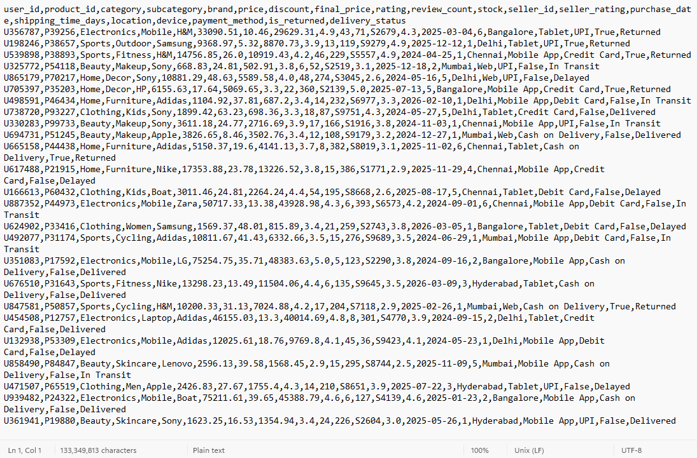
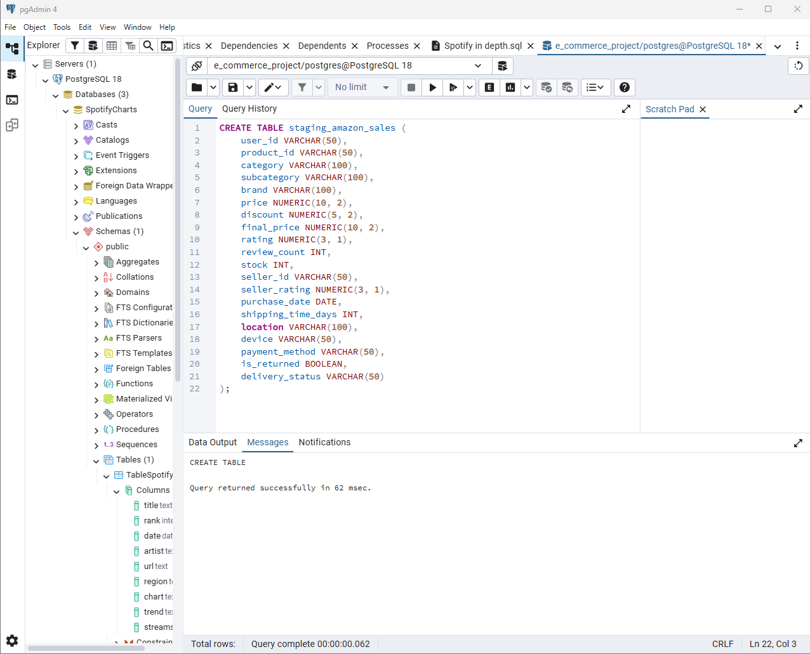
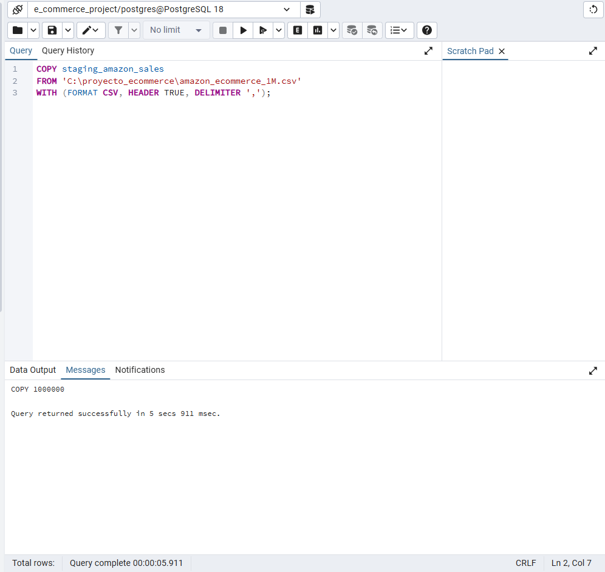
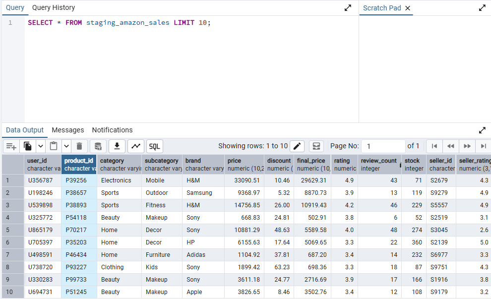
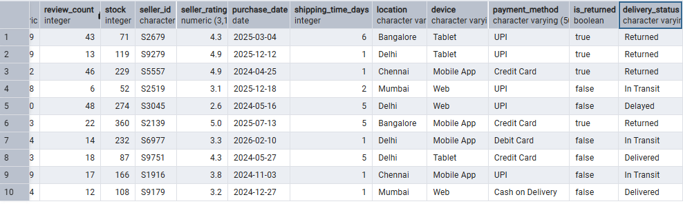

# 📈 E-Commerce Advanced SQL Analytics: 1M+ Operational Records

<!-- PROJECT BANNER PLACEHOLDER -->

## 🎯 Executive Summary
In the modern retail ecosystem, data redundancy and unoptimized data streams can drain company resources and mask critical financial leakage. This project showcases the end-to-end data engineering and business intelligence workflow of a **Data Analyst** acting across **Financial Control, Operations, and Growth Marketing**.

Operating on a high-volume Amazon retail dataset containing **over 1,000,000 raw transactional records**, I designed, implemented, and populated a highly optimized relational **Star Schema** data warehouse in PostgreSQL. Beyond database normalization and maintaining strict data quality constraints, this repository leverages high-performance window functions and advanced aggregations to deliver actionable, data-driven answers to complex corporate bottlenecks.

---

## 🚀 Key Business Problems Solved
This analytical suite directly targets three critical corporate challenges:
1. **User Retention & Omnichannel Loyalty:** Identifying exactly how many days a customer takes to make a repeat purchase across different platforms.
2. **Revenue Leakage Control:** Highlighting specific supplier-category combinations responsible for catastrophic item return rates.
3. **Cumulative Growth Velocity:** Providing corporate leadership with real-time running totals of revenue generation across major product segments to measure progress against annual benchmarks.

---
## 🛠️ Step-by-Step Implementation Guide

### Phase 1: Exploratory Data Inspection & Staging

Before writing a single line of DDL (Data Definition Language), a raw exploration of the source file is essential. Understanding data types, null tendencies, and column delimiters prevents schema failure down the line.

#### 1. Inspecting the Raw Source File
To evaluate the incoming structure, the raw comma-separated values (CSV) database file was inspected using a simple plain-text editor. 

**Key Observations from the Raw File:**
* **Schema Design Mapping:** The file is a flat table containing mixed structural fields. Columns like `user_id`, `product_id`, and `seller_id` are combined with transactional metrics like `price` and `final_price` in a single line.
* **Data Types Identification:** Categorical entries (`category`, `subcategory`, `device`) appear as text, while tracking numbers and counts (`review_count`, `stock`) are structured as discrete integers.
* **Data Quality Constraints:** Currency fields feature precise decimals, demanding numeric casting rather than floats to maintain absolute financial precision. This inspection directly guided the creation of our optimized staging schema.

#### 2. Defining the Staging Schema and Data Types
With the structure of the CSV understood, the next step was to map those fields into a SQL environment. Using pgAdmin's Query Tool, I executed a Data Definition Language (DDL) script to build the target staging table.

**Key Operational Details in this Step:**
* **Strict Type Mapping:** Fields like `price`, `discount`, and `final_price` were explicitly assigned the `NUMERIC(10, 2)` data type instead of a standard `FLOAT`. This guarantees decimal precision for currency calculations and prevents rounding errors during financial aggregations.
* **Date and Boolean Formatting:** Temporal data was cast directly into a strict `DATE` type, while binary flags like `is_returned` were handled using PostgreSQL's native `BOOLEAN` type (`True`/`False`), facilitating faster indexing and logical evaluations later on.
* **Landing Zone Strategy:** This staging table was purposely built without active Foreign Key constraints or Primary Key restrictions. This design choice prevents ingestion failures, ensuring that the entire raw file can be swallowed as-is before any deep normalization or heavy data cleaning takes place.

#### 3. Optimized Bulk Data Ingestion via COPY
Instead of utilizing standard row-by-row `INSERT` statements—which would cause significant latency and overhead on a high-volume dataset—I leveraged PostgreSQL's highly efficient native bulk loading tool using the `COPY` command. 

**Key Performance & Ingestion Insights:**
* **Native Speed Execution:** The `COPY` protocol streams data directly between the server and the filesystem file, resulting in an exceptionally fast ingestion time of just **5 seconds and 911 milliseconds** to pull in all **1,000,000 records**.
* **Ingestion Metadata Parameters:** 
  * `FORMAT CSV`: Tells the engine to expect standard CSV layout formatting.
  * `HEADER TRUE`: Instructs PostgreSQL to safely skip the very first row since it contains the text column headers.
  * `DELIMITER ','`: Specifies commas as the clean separator boundary between each explicit column field value.
* **Landing Success Confirmation:** The output console cleanly returns `COPY 1000000`, confirming that the entire payload was written into the staging schema with zero data truncation, structural misalignment, or corrupted fields.

#### 4. Post-Ingestion Structural Verification
To guarantee data integrity before proceeding to structural normalization, a `SELECT *` query was executed with a `LIMIT 10` constraint. Because the staging table contains 22 columns, the results are captured across two continuous views to audit the entire dataset payload width.

| Left Schema Boundary View (Columns 1-12) |
| :---: |
|  |

| Right Schema Boundary View (Columns 10-21) |
| :---: |
|  |

**Key Validation Benchmarks Accomplished:**
* **Data Alignment Verification:** Checking columns from `user_id` down to `delivery_status` confirms that the data stream aligned perfectly into its corresponding SQL types without shifting columns or placing values in the wrong fields.
* **Format Stability Check:** Temporal records (such as `2025-03-04`) successfully adapted to the ISO `DATE` format, and boolean operational flags properly translated to clean system-level `true`/`false` values.
* **Data Quality Assessment:** This quick look exposes the flat, non-normalized nature of our landing zone—revealing repetitive string attributes (like locations, categories, and brands) duplicating across rows. This visual evidence justifies the immediate need for transitioning into an optimized relational Star Schema model.
